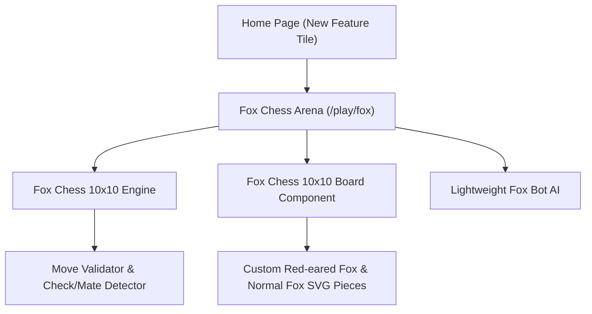
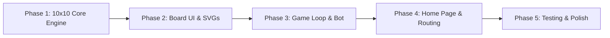

# Implementation Plan: Fox Chess (10×10 Variant)

## 1. Overview & Objective
This plan outlines the architecture and execution strategy for introducing a new chess variant—**Fox Chess**—into the Access Chess Club platform. The variant features:
- An expanded **10×10 board** (2 additional rows and 2 additional columns).
- Two unique fairy pieces:
  - **Red-eared Fox (Fox1)**: Moves 3 squares and turns 1 square (a $(3,1)$ leaper that jumps over pieces).
  - **Normal Fox (Fox2)**: Half-length Queen slider (moves in all 8 Queen directions up to 5 squares maximum out of 10 available).
- Custom starting coordinates designated as **$\alpha$ (Alpha)** for the Red-eared Fox and **$\beta$ (Beta)** for the Normal Fox.
- Direct entry point and selection on the **Home Page**.



---

## 2. Game Rules & Mechanics Specification

### 2.1 The 10×10 Board & Coordinate System
- **Dimensions**: 10 ranks $\times$ 10 files (100 squares total).
- **Files (Columns in order from Left to Right)**:
  $$a, b, c, \alpha, d, e, \beta, f, g, h$$
  - Column 1: $a$
  - Column 2: $b$
  - Column 3: $c$
  - Column 4: $\alpha$ (Alpha — home of the **Red-eared Fox**)
  - Column 5: $d$ (Queen)
  - Column 6: $e$ (King)
  - Column 7: $\beta$ (Beta — home of the **Normal Fox**, immediately next to $f$)
  - Column 8: $f$
  - Column 9: $g$
  - Column 10: $h$
- **Ranks (Rows)**: Ranks 1 to 10 (White occupies ranks 1–2; Black occupies ranks 9–10).

### 2.2 Starting Position & Piece Order
The 10 back-rank pieces are placed in the exact specified order:

$$\text{Rook} \longrightarrow \text{Knight} \longrightarrow \text{Bishop} \longrightarrow \textbf{Red-eared Fox} \longrightarrow \text{Queen} \longrightarrow \text{King} \longrightarrow \textbf{Normal Fox} \longrightarrow \text{Bishop} \longrightarrow \text{Knight} \longrightarrow \text{Rook}$$

- **White Back Rank (Rank 1)**:
  - $a1$: Rook
  - $b1$: Knight
  - $c1$: Bishop
  - $\alpha 1$: **Red-eared Fox (Fox1)**
  - $d1$: Queen
  - $e1$: King
  - $\beta 1$: **Normal Fox (Fox2)**
  - $f1$: Bishop
  - $g1$: Knight
  - $h1$: Rook
- **White Pawns (Rank 2)**: 10 Pawns across $a2, b2, c2, \alpha 2, d2, e2, \beta 2, f2, g2, h2$.
- **Black Pawns (Rank 9)**: 10 Pawns across $a9, b9, c9, \alpha 9, d9, e9, \beta 9, f9, g9, h9$.
- **Black Back Rank (Rank 10)**:
  - $a10$: Rook
  - $b10$: Knight
  - $c10$: Bishop
  - $\alpha 10$: **Red-eared Fox (Fox1)**
  - $d10$: Queen
  - $e10$: King
  - $\beta 10$: **Normal Fox (Fox2)**
  - $f10$: Bishop
  - $g10$: Knight
  - $h10$: Rook

> [!NOTE]
> This arrangement provides perfect symmetrical balance across the 10 columns:
> - **Queen's Wing (left)**: Rook ($a$), Knight ($b$), Bishop ($c$), Red-eared Fox ($\alpha$).
> - **Center**: Queen ($d$), King ($e$).
> - **King's Wing (right)**: Normal Fox ($\beta$), Bishop ($f$), Knight ($g$), Rook ($h$).

---

### 2.3 Piece Movements & Abilities

| Piece | Glyph / Symbol | Movement Rule | Special Attributes |
| :--- | :---: | :--- | :--- |
| **Red-eared Fox (Fox1)** | 🦊🔴 (`rf` / `RF`) | **Leaper (3 squares + 1 turn)**: Moves 3 squares in one orthogonal direction and 1 square perpendicular $(\pm 3, \pm 1)$ or $(\pm 1, \pm 3)$. | **Jumps** over intervening pieces (identical to the fairy chess *Camel*). Color-bound leaper. |
| **Normal Fox (Fox2)** | 🦊 (`f` / `F`) | **Short Slider (Half-length Queen)**: Slides along any of the 8 Queen directions (orthogonal or diagonal) up to a **maximum of 5 squares** out of the 10 available squares on the board. | Cannot jump; stops at board edges or when obstructed. Captures the first enemy piece encountered within 5 squares. |
| **Queen** | ♛ / ♕ | Slides any number of unobstructed squares in all 8 directions (up to 9 squares on 10×10). | Standard slider. |
| **Rook** | ♜ / ♖ | Slides orthogonally any number of unobstructed squares (up to 9 squares). | Standard slider. |
| **Bishop**| ♝ / ♗ | Slides diagonally any number of unobstructed squares. | Standard slider. |
| **Knight**| ♞ / ♘ | Leaps $(\pm 2, \pm 1)$ or $(\pm 1, \pm 2)$ (2 squares + 1 turn). | Standard leaper. |
| **Pawn**  | ♟ / ♙ | Moves forward 1 square; optional 2-square advance from starting rank (Rank 2 for White, Rank 9 for Black). Captures diagonally forward 1 square. | Promotes upon reaching Rank 10 (White) or Rank 1 (Black) into Queen, Rook, Bishop, Knight, Red-eared Fox, or Normal Fox. En passant applies to 2-square advances. |
| **King**  | ♚ / ♔ | Moves 1 square in any direction. Must not move into check. | Castling can be performed with either Rook (King moves 2 or 3 squares towards Rook; Rook leaps over). |

---

## 3. Technical Strategy & Architectural Design

### 3.1 Why a Custom Engine is Required
The project's current dependencies (`chess.js` and `react-chessboard`) are strictly hardcoded for standard 8×8 chess:
- `chess.js` enforces 64-square bitboards/arrays, files $a-h$, and standard FEN parsing. It rejects 10×10 coordinates and custom pieces.
- `react-chessboard` renders an SVG 8×8 grid with fixed file/rank math.

**Solution**:
1. Implement a clean, zero-dependency 10×10 engine: `src/services/foxChessEngine.js`.
2. Implement a responsive, GPU-accelerated CSS Grid board component: `src/components/chess/FoxChessBoard.jsx`.

### 3.2 System Architecture

```
src/
├── services/
│   └── foxChessEngine.js        # 10x10 state, move generation, checks, FEN, AI bot
├── hooks/
│   └── useFoxChessGame.js       # Game loop hook (turns, timer, undo, bot triggers)
├── components/chess/
│   ├── FoxChessBoard.jsx        # 10x10 interactive board (drag/drop + click-to-move)
│   ├── FoxChessBoard.module.css # Board styling, responsive square sizes, indicators
│   └── pieces/
│       └── FoxIcons.jsx         # Custom SVG paths for Red-eared Fox and Normal Fox
├── pages/
│   ├── FoxPlayPage/             # Dedicated 10x10 Play page with move log, captured trays
│   └── HomePage/
│       └── HomePage.jsx         # Enhanced with Fox Chess entry card
└── utils/
    └── constants.js             # Routes, glyphs, and piece values for Fox pieces
```

---

## 4. Component & Module Breakdown

### 4.1 The Engine (`foxChessEngine.js`)
- **State Representation**:
  - `board`: $10 \times 10$ 2D array indexed by algebraic notation (`a1` ... `h10` including `alpha` and `beta`).
  - `turn`: `'w'` or `'b'`.
  - `castlingRights`: `{ w: { k: true, q: true }, b: { k: true, q: true } }`.
  - `enPassantSquare`: target square or `null`.
  - `halfmoveClock`: for 50-move rule.
  - `moveNumber`: incremented after Black's move.
- **Move Generators**:
  - `getRedEaredFoxMoves(square, color)`: computes candidate $(3,1)$ leaps; verifies target is empty or enemy.
  - `getNormalFoxMoves(square, color)`: rays in 8 Queen directions up to `step <= 5`; stops on collision.
  - Standard generators for King, Queen, Rook, Bishop, Knight, Pawn.
- **Validation & Check Detection**:
  - `isSquareAttacked(square, byColor)`: checks if any enemy piece (including Red-eared Fox and Normal Fox) attacks `square`.
  - `inCheck(color)`: locates the King and tests attack status.
  - `getLegalMoves(square)`: simulates candidate move and discards any that leaves own King in check.
  - `isCheckmate()` / `isStalemate()`: evaluated when active player has 0 legal moves.
- **Bot Engine (`pickFoxBotMove`)**:
  - Evaluation prioritizing checkmate, material captures (Queen=9, Normal Fox=7, Rook=5, Red-eared Fox=4, Bishop=3, Knight=3, Pawn=1), and central positioning.

### 4.2 Board Component (`FoxChessBoard.jsx`)
- **Rendering**: CSS Grid `repeat(10, 1fr)` with alternating light (`#f0d9b5`) and dark (`#63615f`) squares.
- **Edge Notations**:
  - Horizontal files: $a, b, c, \alpha, d, e, \beta, f, g, h$.
  - Vertical ranks: $10 \dots 1$.
- **Visual Feedback**:
  - Selected square highlight (subtle amber halo).
  - Legal destination indicators (subtle dot for empty squares, capture ring for enemy targets).
  - Check indicator (red pulse around King in check).
  - Last move highlight (from / to square tint).
- **Interactions**:
  - Both **Drag & Drop** (HTML5 Drag / Pointer events) and **Click-to-Move** (accessible for mobile and trackpads).

### 4.3 Custom Fox Piece Art (Staunton-Consistent Design)

> [!IMPORTANT]
> **Visual Style Matching Requirement**: The Fox piece icons MUST match the exact visual style, stroke weight, pedestal base, and shading aesthetic of the standard chess pieces (Staunton / cburnett SVG standard). They should look like organic members of the traditional chess set rather than modern emoji or cartoon avatars.

- **Design Philosophy**:
  - Modeled after the traditional Knight piece silhouette (sculpted animal bust mounted on a classical flared Staunton pedestal and collar ring).
  - Consistent viewBox ($45 \times 45$ or standard $100 \times 100$), stroke width ($1.5\text{px}$ to $2\text{px}$), and outline curvature.
  - **Color Palette Consistency**:
    - **White Pieces**: Solid white/ivory body (`#ffffff`), solid black outline (`#000000`), subtle interior fold lines matching the Knight's mane and King's cross.
    - **Black Pieces**: Solid black/charcoal body (`#000000`), white contour highlights (`#ffffff`), identical pedestal base.
- **Specific Piece Designs**:
  - **Red-eared Fox**: Staunton-style fox head profile with alert, pointed ears. Features delicate crimson/red inner-ear accents (`#d32f2f` / `#ef5350`) subtly integrated into the classic Staunton line art.
  - **Normal Fox**: Staunton-style fox head profile with refined fox muzzle, sleek fur ruff, and classic monochrome Staunton styling matching the King, Queen, and Knight.

### 4.4 Home Page UI Integration (`HomePage.jsx`)
- Add a featured card in the "The Hall" grid:
  - **Glyph**: 🦊
  - **Title**: `FOX CHESS (10×10)`
  - **Description**: *"Play the expanded variant featuring the Red-eared Fox and Normal Fox across a 100-square battlefield."*
  - **Call-to-Action**: Direct link to `/play/fox`.
- Add a quick toggle on `/play` to easily switch between Standard 8×8 and Fox 10×10.

---

## 5. Phased Implementation Roadmap



### Phase 1: Core Engine & Move Rules
1. Create `src/services/foxChessEngine.js`.
2. Implement 10×10 coordinates with files $a, b, c, \alpha, d, e, \beta, f, g, h$ and ranks 1–10.
3. Write move generators for Red-eared Fox ((3,1) leaper) and Normal Fox (5-range queen).
4. Implement standard piece moves adapted for 10×10.
5. Implement check, checkmate, stalemate, and capture tracking.

### Phase 2: Board UI & Custom Piece Art
1. Create `src/components/chess/pieces/FoxIcons.jsx` with high-quality SVGs (Red-eared Fox and Normal Fox).
2. Build `src/components/chess/FoxChessBoard.jsx` with responsive 10×10 CSS Grid.
3. Add drag-and-drop and click-to-move interaction handlers.
4. Add visual indicators (legal move dots, capture rings, king check glow, last move trails).

### Phase 3: Game Loop Hook & Bot Player
1. Create `src/hooks/useFoxChessGame.js` managing game state, move history, captured pieces, and undo.
2. Implement AI bot with basic material & capture evaluation for solo play.
3. Build `FoxPlayPage.jsx` featuring game clocks, captured trays, and move notation panel.

### Phase 4: Home Page Integration & Routing
1. Update `src/utils/constants.js` with `ROUTES.foxPlay = '/play/fox'`.
2. Register route in `src/routes/AppRouter.jsx`.
3. Update `src/pages/HomePage/HomePage.jsx` with the Fox Chess feature tile and banner.
4. Add a "Rules of Fox Chess" modal explaining Red-eared Fox and Normal Fox movements with visual diagrams.

### Phase 5: Verification & Testing
1. Test Red-eared Fox leap logic: verify jumping over obstacles and color-bound movement.
2. Test Normal Fox slide logic: verify max 5-square limitation and obstacle collision.
3. Test edge coordinates ($a1$ to $h10$, $\alpha$, $\beta$).
4. Test responsive layout on mobile screens down to 360px width.
5. Lint and build check (`npm run lint`, `npm run build`).

---

## 6. Key Decisions & Configuration Summary

> [!IMPORTANT]
> 1. **Piece Order**: $\text{Rook}, \text{Knight}, \text{Bishop}, \textbf{Red-eared Fox}, \text{Queen}, \text{King}, \textbf{Normal Fox}, \text{Bishop}, \text{Knight}, \text{Rook}$.
> 2. **File Alignment**: Files arranged as $[a, b, c, \alpha, d, e, \beta, f, g, h]$, where Red-eared Fox is at $\alpha$ (col 4) and Normal Fox is at $\beta$ (col 7, immediately next to $f$).
> 3. **Piece Mechanics**:
>    - **Red-eared Fox**: Moves 3 squares + turns 1 square (jumps over intervening pieces).
>    - **Normal Fox**: Moves in all Queen directions up to 5 squares maximum (blocked by obstacles).
> 4. **Piece Icon Style**: **Strict Staunton Match**. The Red-eared Fox and Normal Fox icons must match the traditional chess set style (pedestal base, stroke thickness, classical proportions, seamless fit beside the King, Queen, Bishop, Knight, and Rook).
> 5. **Initial Play Mode**: Launch with **Local Play (Player vs Bot and Pass & Play)** with direct access from the **Home Page**.
